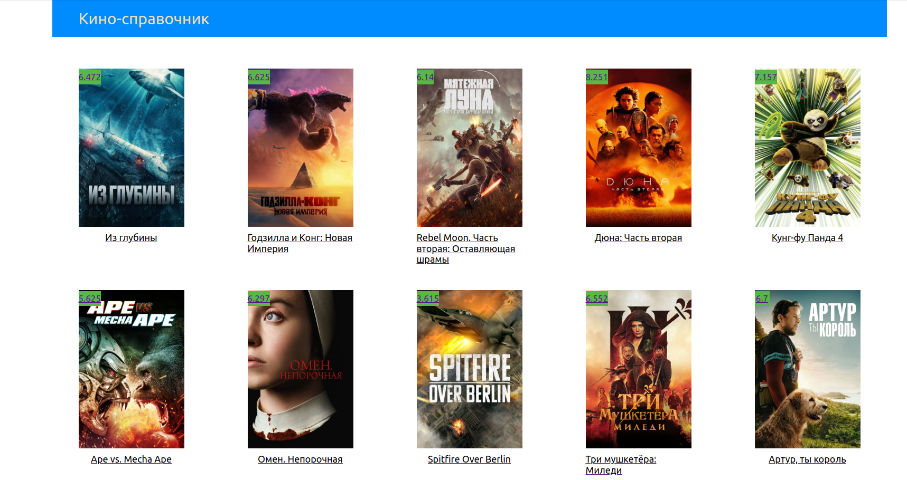
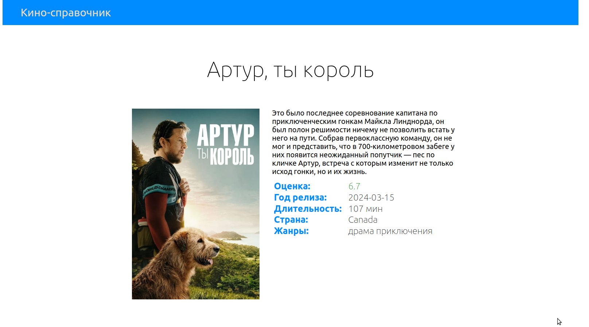
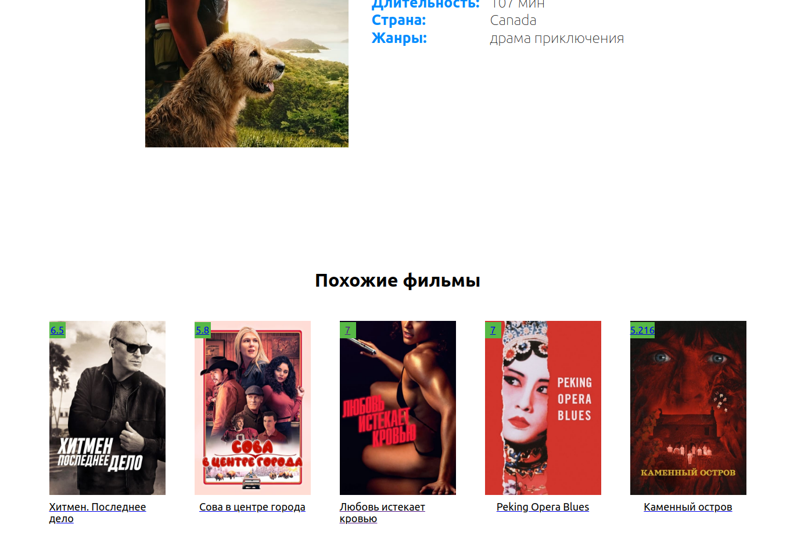

# Профильное задание на позицию React-разработчик

Необходимо сверстать список фильма и карточку фильма, используя (API)[https://developer.themoviedb.org/docs/getting-started]. Стоит обратить внимание, что данная __API работает только с VPN.__ 
Основная технологии: 
- React
- Redux
- Saga
- SCSS

 

Ниже приведены снимки с интерфейсом проекта:
 
 
 
