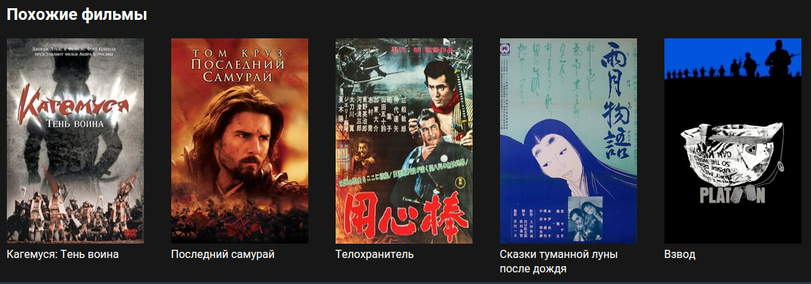
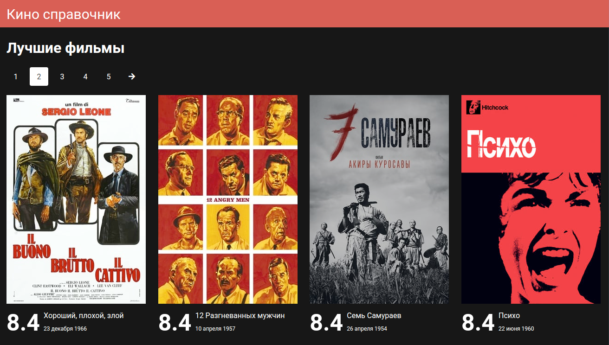
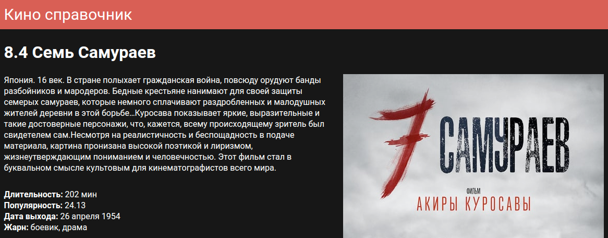

# Профильное задание на позицию React-разработчик

Необходимо сверстать список фильма и карточку фильма, используя (API)[https://developer.themoviedb.org/docs/getting-started]. Можно воспользоваться (базой Кинопоиска)[https://kinopoisk.dev/] (ограничение на 200 запросов в сутки) либо любым другим API. 
Основная технология - __React__. 
Ниже приведены референсы:
 
 
 

## TODO

1. docker
1. Настроить nginx
1. Доработать стили
1. Исправить баг с начальной страницей
1. Может задеплоить
